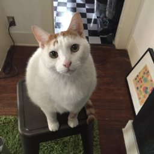

*What I cannot create, I do not understand - Richard Feynman*

### essence

A directed acyclic computational graph builder, built from scratch on `numpy` and `C`, with auto-differentiation supported.

### Demos

- `mnist-mlp.py`: Depth-2 multi layer perceptron, with ReLU and Dropout; 95.3% on MNIST.

- `lenet-bn.py`: LeNet with Batch Normalization on first layer, 97% on MNIST.

- `lstm-embed.py`: LSTM on word embeddings for Vietnamese Question classification + Dropout + L2 weight decay. 85% on test set and 98% on training set (overfit).

- `turing-copy.py`: A neural turing machine with LSTM controller. Test result on copy task length 70:


- `visual-answer.py`. Visual question answering with *pretrained* weight from VGG16 and a stack of 3 basic LSTMs, on Glove word2vec.

<p align="center">  </p>

```
Q: What is the animal in the picture?      . A: cat
Q: Where is the cat sitting on?            . A: floor
Q: Is it male or female?                   . A: female
Q: Is she smiling?                         . A: yes
Q: What is her color?                      . A: blue
```


**TODO**: Memory network and GAN, for that I need to improve my speed of `im2col` and `gemm` for `conv` module first.

### License
GPL 3.0 (see License in this repo)