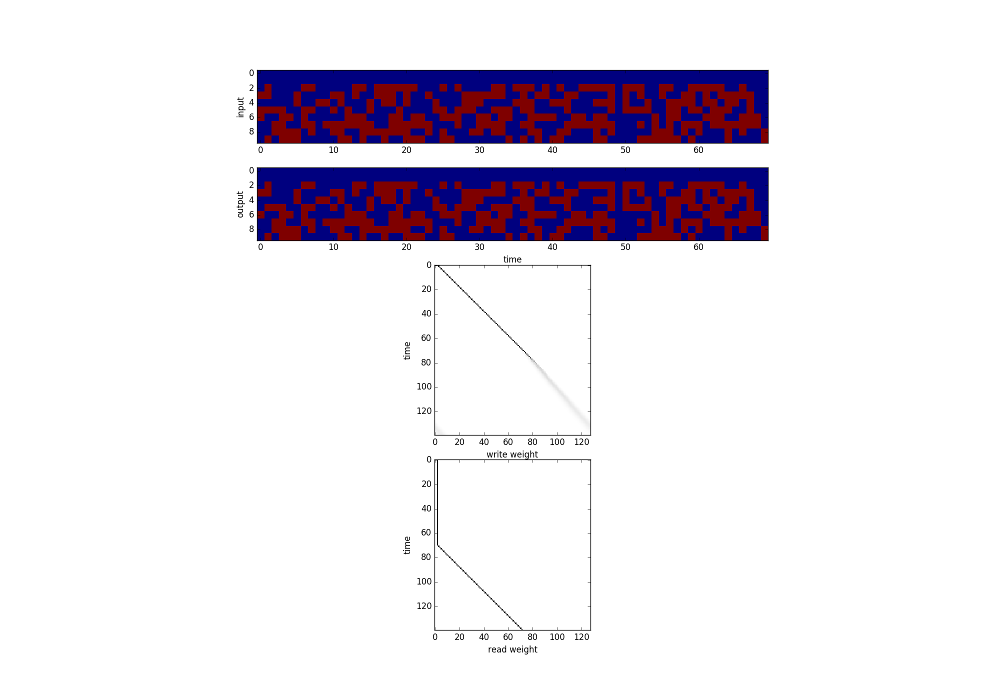

*What I cannot create, I do not understand - Richard Feynman*

### essence

A directed acyclic computational graph builder, built from scratch on `numpy` and `C`, with auto-differentiation and gradient unit testing.

*Motivation:* if there is one algorithm to understand in Deep Learning, that might be Back Propagation. Not chaining derivaties on paper but the actual implementation of it, see for yourself vanishing/exploding gradients, numerical underflow/overflow and then being able to solve them is just wonderful.

### Tests

1. `mnist-mlp.py`: Depth-2 multi layer perception, with ReLU and Dropout; 95.3% on MNIST.

2. `lenet-bn.py`: LeNet with Batch Normalization on first layer, 97% on MNIST.

3. `lstm-embed.py`: LSTM on word embeddings for Vietnamese Question classification + Dropout + L2 weight decay. 85% on test set and 98% on training set (overfit).

4. `turing-copy`: A neural turing machine, with copy task. Test result on length 70:

TODO: GAN, although I need to improve my implementation of `im2col` and `gemm` for `conv` module.

### License
GPL 3.0 (see License in this repo)